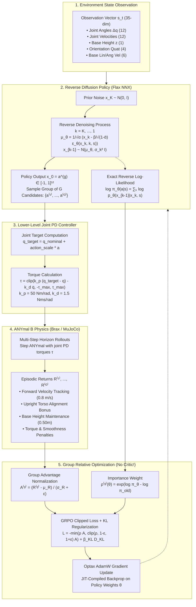

# ANYmal Quadruped Locomotion: GRPO-Style Diffusion Policy & Transformer World Model in JAX

Implementation of **Group Relative Policy Optimization (GRPO)** for a **Diffusion Policy** controlling the **ANYmal B Quadruped Robot** for walking in **Brax / MuJoCo**, alongside an **Auto-Regressive Causal Transformer World Model** with **MPPI Planning**, built with **JAX**, **Flax (NNX API)**, **Optax**, and **Bazel**.

---

## 🌟 GRPO Diffusion Policy Architecture & Block Diagram

```
+─────────────────────────────────────────────────────────────────────────────────────────────────────────────+
│                                              GRPO Training Loop                                             │
│                                                                                                             │
│   1. Environment State Observation:                                                                         │
│      s_t in R^35 (Joint angles, joint vels, base height, orientation quat, lin/ang vel)                     │
│                                                                                                             │
│   2. Group Rollout Sampling via Stochastic Diffusion Denoising:                                             │
│      For candidate g = 1, ..., G:                                                                           │
│        x_K ~ N(0, I) ──► Denoising Net eps_theta(x_k, k, s_t) ──► ... ──► x_0 = a^(g) in [-1, 1]^12         │
│        Reverse Trajectory Log-Likelihood: log pi_old(a^(g) | s_t) = sum_{k=1}^K log p_theta(x_{k-1}|x_k, s) │
│                                                                                                             │
│   3. Lower-Level Joint PD Impedance Controller:                                                             │
│      q_target = clip(q_nominal + a^(g) * action_scale, q_min, q_max)                                        │
│      tau = clip(kp * (q_target - q) - kd * q_dot, -tau_max, tau_max)                                        │
│                                                                                                             │
│   4. Physics Simulation Rollouts (Brax ANYmal B):                                                           │
│      Execute over horizon H ──► Evaluate discounted returns R^(1), ..., R^(G)                               │
│                                                                                                             │
│   5. Critic-Free Group Relative Advantage Normalization:                                                    │
│      Adv^(g) = (R^(g) - mean({R^(j)})) / (std({R^(j)}) + eps)                                               │
│                                                                                                             │
│   6. GRPO Clipped Surrogate Loss & Parameter Update:                                                        │
│      ratio^(g)(theta) = exp(log pi_theta(a^(g)|s_t) - log pi_old(a^(g)|s_t))                               │
│      L_GRPO = -1/(B*G) sum min(ratio * Adv, clip(ratio, 1-eps, 1+eps) * Adv) + beta_KL * D_KL               │
+─────────────────────────────────────────────────────────────────────────────────────────────────────────────+
```

### Detailed System Dataflow Diagram



---

## 🦿 Mathematical Formulation

### 1. Reverse Diffusion Policy Log-Likelihood
The policy denoises noisy action $x_K \sim \mathcal{N}(0, I)$ down to $x_0 = a \in [-1, 1]^{12}$ across $K$ timesteps:
$$\mu_\theta(x_k, k, s) = \frac{1}{\sqrt{\alpha_k}} \left( x_k - \frac{\beta_k}{\sqrt{1 - \bar{\alpha}_k}} \epsilon_\theta(x_k, k, s) \right)$$
$$\sigma_k^2 = \frac{1 - \bar{\alpha}_{k-1}}{1 - \bar{\alpha}_k} \beta_k$$
$$p_\theta(x_{k-1} | x_k, s) = \mathcal{N}\left(x_{k-1}; \mu_\theta(x_k, k, s), \sigma_k^2 I\right)$$

The exact trajectory log-likelihood under the reverse diffusion chain is:
$$\log \pi_\theta(a | s) = \sum_{k=1}^K \log p_\theta(x_{k-1} | x_k, s) = -\frac{1}{2} \sum_{k=1}^K \left[ \frac{\|x_{k-1} - \mu_\theta(x_k, k, s)\|^2}{\sigma_k^2} + d \log(2\pi \sigma_k^2) \right]$$

### 2. Lower-Level Joint PD Control Law
Given nominal standing configuration $q_{\text{nominal}}$:
$$q_{\text{target}} = \text{clip}(q_{\text{nominal}} + \text{scale} \cdot a, q_{\text{lower}}, q_{\text{upper}})$$
$$\tau = \text{clip}\left( k_p (q_{\text{target}} - q) - k_d \dot{q}, -\tau_{\max}, \tau_{\max} \right)$$
where $k_p = 50.0\text{ N}\cdot\text{m/rad}$, $k_d = 1.5\text{ N}\cdot\text{m}\cdot\text{s/rad}$, $\tau_{\max} = 40.0\text{ N}\cdot\text{m}$, and $\text{scale} = 0.3\text{ rad}$.

### 3. Group Relative Policy Optimization (GRPO)
GRPO samples a group of $G$ candidate trajectories per state, completely eliminating the need for a separate critic / value function network:
$$A_i^{(g)} = \frac{R_i^{(g)} - \frac{1}{G} \sum_{j=1}^G R_i^{(j)}}{\sqrt{\frac{1}{G} \sum_{j=1}^G (R_i^{(j)} - \bar{R}_i)^2} + \epsilon}$$

Policy objective with clipped importance ratios and KL divergence penalty:
$$r_i^{(g)}(\theta) = \exp\left( \log \pi_\theta(a_i^{(g)} | s_i) - \log \pi_{\theta_{\text{old}}}(a_i^{(g)} | s_i) \right)$$
$$\mathcal{L}_{\text{GRPO}}(\theta) = -\frac{1}{B \cdot G} \sum_{i=1}^B \sum_{g=1}^G \left[ \min\left( r_i^{(g)}(\theta) A_i^{(g)}, \text{clip}(r_i^{(g)}(\theta), 1-\epsilon_{\text{clip}}, 1+\epsilon_{\text{clip}}) A_i^{(g)} \right) - \beta_{\text{KL}} D_{\text{KL}}(\pi_\theta \| \pi_{\text{ref}}) \right]$$

---

## 🛠️ Repository Structure

```text
transformer_world_model/
├── configs/
│   ├── grpo_diffusion_anymal.yaml # GRPO Diffusion Policy hyperparams
│   ├── env_anymal_b.yaml          # ANYmal B environment settings
│   ├── env_brax_ant.yaml          # Brax Ant benchmark
│   └── model_twm_base.yaml        # Transformer World Model config
├── twm/
│   ├── algorithms/
│   │   └── diffusion_grpo.py      # GRPO Algorithm (Group sampling, Advantage, Clipped loss)
│   ├── envs/
│   │   ├── pd_controller.py       # Low-level Joint PD Impedance Controller
│   │   ├── anymal_env.py          # ANYmal B Brax environment & walking rewards
│   │   ├── brax_wrapper.py        # Vectorized Brax Environment Wrapper
│   │   └── tokenization.py        # Continuous state/action tokenizers
│   ├── models/
│   │   ├── diffusion_policy.py    # Flax NNX Diffusion Policy & Exact Likelihood Evaluator
│   │   ├── transformer.py         # Causal Transformer World Model
│   │   ├── attention.py           # Causal Multi-Head Self-Attention
│   │   └── heads.py               # Dynamics, reward & termination heads
│   ├── planner/
│   │   └── mppi.py                # MPPI Planner with jax.lax.scan rollouts
│   └── utils/
│       ├── buffer.py              # Sequence Replay Buffer
│       └── prng.py                # JAX PRNG key sequencing
├── scripts/
│   ├── train_diffusion_grpo.py    # End-to-end GRPO Diffusion training on ANYmal
│   ├── visualize_diffusion_policy.py # Visualizer: Telemetry plots & 3D HTML viewer
│   ├── visualize_anymal.py        # ANYmal kinematic simulator
│   ├── 01_collect_data.py         # World Model data collection
│   ├── 02_train_model.py          # World Model training
│   └── 03_evaluate_mppi.py        # MPPI planner evaluation
└── tests/
    ├── test_diffusion_grpo.py     # Test suite for PD controller, Diffusion & GRPO
    ├── env_test.py                # Brax environment test
    ├── model_test.py              # Transformer model test
    └── mppi_test.py               # MPPI planner test
```

---

## 🚀 Quickstart

### Option A — the development container (recommended)

Everything is pre-installed and the container is built to safely share a machine with
other Docker stacks without interfering with them (thanks to automatic namespace isolation and port collision checks).

```bash
# 1. (Optional) Check for port collisions with other containers
make ports

# 2. Build the development image
make docker-build

# 3. Start the container in the background
make docker-up

# 4. Drop into an interactive shell inside the container
make docker-shell
```

If you encounter port collisions with another project, run `make env`, edit the `.env` file to choose different host ports, and try `make docker-up` again.

The noVNC desktop is then at **<http://localhost:6095/vnc_lite.html?scale=true>**.
On a host with an NVIDIA GPU and the container toolkit, `make docker-up-gpu`
attaches one GPU instead. Tear down with `make docker-down` (or `make docker-clean`
to drop the cached home volume too).

> **Note** — `pyproject.toml` pins the CPU wheels of `jax`/`jaxlib`. `make
> docker-up-gpu` reserves a device and turns off XLA preallocation, but until a
> CUDA build of JAX is installed the workload still runs on CPU.

### Option B — a local virtualenv

```bash
python3 -m venv .venv && source .venv/bin/activate
make install        # pip install -e ".[dev]"
make doctor         # report what is and is not available
```

The Makefile discovers the interpreter (explicit `PYTHON=`, then an activated
virtualenv, then `./.venv`, then `python3`), so no command below hardcodes a path.
Every target also works unchanged inside the container — the Makefile detects
`/.dockerenv` and skips the `docker compose exec` wrapper.

### Run things

```bash
make test           # unit tests (both *_test.py and test_*.py discovery patterns)
make lint           # Ruff + Flake8 + the IFTTT cross-file validator
make format         # Ruff + Black
make ci-local       # the full CI workflow locally
make bazel-build    # Bazel build, inside the container (the host has no C toolchain)
make bazel-test     # Bazel tests

make train-grpo     # GRPO diffusion-policy training on ANYmal B
make visualize-grpo # telemetry plot + interactive 3D HTML
make collect-anymal # ANYmal B data collection into the replay buffer
make train          # Transformer World Model training
make evaluate       # closed-loop MPPI evaluation
```

`make help` lists every target.

> **Status** — no checkpointing is implemented yet: nothing in `twm/` or `scripts/`
> saves or loads model weights. `make evaluate`, `make visualize-anymal` and
> `make visualize-grpo` therefore each construct a **freshly initialised, untrained**
> model, and `make collect-data` writes no artifact for `make train` to read. The
> committed `anymal_diffusion_*.{png,html}` are renders of an untrained policy, not
> of a trained gait.

---

## 🐳 How the container stays out of other containers' way

This machine runs more than one robotics stack. The compose setup is built so that
bringing this one up cannot disturb the others.

| Concern | What this repo does |
|---|---|
| **Host ports** | Defaults are `6095` (noVNC), `5915` (VNC), `6016` (TensorBoard), `8898` (Jupyter) — chosen clear of the canonical `5900/5901/6006/6080/8888` that most VNC and notebook containers grab. `make docker-up` preflights them and refuses to start on a collision, naming what to change. Its own already-running container is not counted as a collision. |
| **Names** | `COMPOSE_PROJECT_NAME` (default `twm`) namespaces the container, network, image and volumes. No fixed `container_name`, so a second checkout just needs a different project name in its `.env`. |
| **Exposure** | Ports bind to `127.0.0.1` by default (`BIND_ADDR`). The VNC server runs `-nopw`, so it is never put on the LAN unless you ask. |
| **IPC** | A private IPC namespace with an explicit 4 GB `/dev/shm`. `ipc: host` would share the host's shared-memory and semaphore namespace with every other `ipc: host` container — and would silently make `shm_size` a no-op. |
| **CPU / memory** | `cpus` and `mem_limit` (`TWM_CPUS`, `TWM_MEM`) with `OMP_NUM_THREADS` kept in step, so XLA does not take one thread per host core and starve the neighbours. |
| **Process reaping** | `init: true` runs tini as PID 1, so the Xvfb/x11vnc/websockify processes orphaned on a VNC restart are reaped instead of piling up as unkillable zombies. |
| **File ownership** | The container runs as the host UID/GID, so it never leaves root-owned files in the bind-mounted working tree. |
| **Caches** | Bazel's output base, the pip cache and shell history live in a project-scoped named volume, not in the host `~/.cache`. `make docker-clean` removes only this project's volumes. |
| **Host home** | `~/.gitconfig` and `~/.ssh` are mounted read-only, with an empty stand-in when the host has neither — so `docker compose up` never creates stray files in your home. |
| **Build context** | `.dockerignore` keeps `.git` and the ~700 MB of `third_party/` submodules out of the build context, which would otherwise be uploaded to the shared daemon on every build. |

To run two checkouts at once, put this in the second one's `.env` (values unquoted):

```ini
COMPOSE_PROJECT_NAME=twm-experiment
HOST_NOVNC_PORT=6096
HOST_VNC_PORT=5916
HOST_TENSORBOARD_PORT=6017
HOST_JUPYTER_PORT=8899
```

Everything overridable is documented in [`.env.example`](.env.example).

---

## 🤖 ANYmal B Quadruped Specification

| Parameter | Value | Description |
|---|---|---|
| **Actuated Joints** | 12 | 3 DOF per leg: HAA (Adduction/Abduction), HFE (Hip Flexion/Extension), KFE (Knee Flexion/Extension) |
| **Observation Dim** | 35 | $q - q_{\text{nominal}}$ (12), $\dot{q}$ (12), $z$ (1), quaternion (4), $v$ (3), $\omega$ (3) |
| **Action Dim** | 12 | Residual joint position targets $\Delta q \in [-1, 1]^{12}$ scaled by 0.3 rad |
| **PD Gains** | $k_p = 50.0$, $k_d = 1.5$ | Joint impedance stiffness ($N\cdot m/rad$) and damping ($N\cdot m\cdot s/rad$) |
| **Peak Torque Limit** | $\pm 40.0\text{ N}\cdot\text{m}$ | Motor saturation limits per actuator |
| **Target Walking Speed** | $0.8\text{ m/s}$ | Desired forward linear velocity along body x-axis |

---

## 📚 References & Background

1. **GRPO**: *DeepSeekMath: Pushing the Limits of Mathematical Reasoning in Open Language Models* (Shao et al., 2024).
2. **Diffusion Policy**: *Diffusion Policy: Visuomotor Policy Learning via Action Diffusion* (Chi et al., 2023).
3. **Diffusion RL**: *DPOK: Directed Policy Optimization with Diffusion Models* (Fan et al., 2023).
4. **Quadruped Control**: *Learning Quadrupedal Locomotion over Challenging Terrain* (Lee et al., 2020).
5. **Brax Physics Engine**: *Brax - A Differentiable Physics Engine for Large Scale Rigid Body Simulation* (Freeman et al., 2021).
